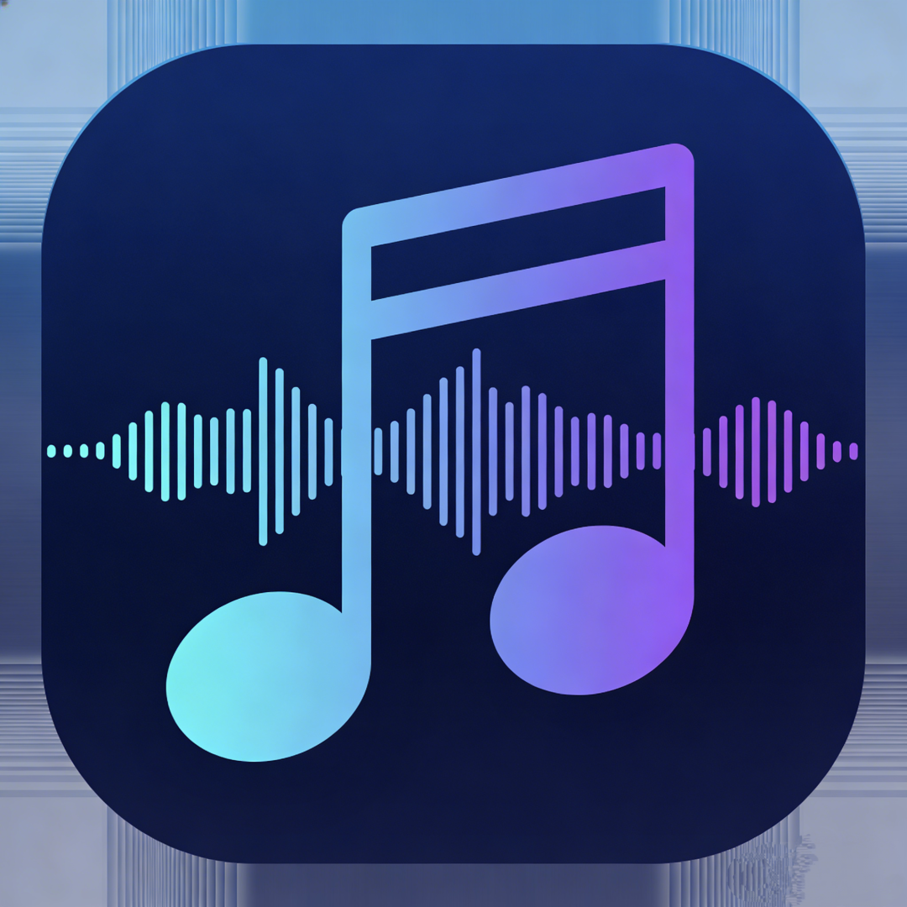

# LinkTune

<p align="center">
  
</p>

<p align="center">
  <strong>联万物音源，听无损好音</strong>
</p>

<p align="center">
  <a href="../../actions/workflows/release.yml"></a>
  <a href="../../releases"></a>
  <a href="LICENSE"></a>
</p>

<p align="center">
  <a href="#功能特性">功能特性</a> •
  <a href="#支持的协议">支持的协议</a> •
  <a href="#安装">安装</a> •
  <a href="#开发">开发</a> •
  <a href="#构建">构建</a> •
  <a href="#技术栈">技术栈</a>
</p>

---

LinkTune 是一款多协议音乐播放器，支持连接多种自建音乐服务器（Emby、Navidrome 等），在统一的界面中享受您的音乐收藏。

## 功能特性

- 🎵 **多协议支持** - 支持 Emby、Navidrome/Subsonic 等多种音乐服务协议
- 🎨 **现代化界面** - 基于 Ant Design 的精美深色/浅色主题
- 📝 **歌词显示** - 支持在线歌词获取，歌词跟随播放自动滚动
- 🎚️ **音质选择** - 流畅(128kbps)、标准(192kbps)、高品质(320kbps)、无损多档可选
- 📋 **歌单管理** - 浏览和播放服务器上的歌单
- 🖥️ **跨平台** - 支持 macOS、Windows、Linux 桌面端，以及 iOS、Android 移动端
- 🎛️ **完整播放控制** - 顺序播放、单曲循环、随机播放，播放队列管理

## 支持的协议

| 协议      | 状态      | 认证方式                      |
| --------- | --------- | ----------------------------- |
| Emby      | ✅ 支持   | API Key / 用户名密码          |
| Navidrome | ✅ 支持   | Subsonic API (用户名 + Token) |
| Subsonic  | ✅ 支持   | 用户名 + Token                |
| Jellyfin  | 🚧 计划中 | -                             |
| Plex      | 🚧 计划中 | -                             |

## 安装

### 下载安装包

前往 [Releases](../../releases) 页面下载对应平台的安装包：

- **macOS**: `.dmg` (支持 Intel 和 Apple Silicon)
- **Windows**: `.exe` (NSIS 安装程序)
- **Linux**: `.AppImage`
- **Android**: `.apk` (直接安装)

#### macOS 安装说明

由于应用未进行 Apple 签名，首次打开时可能会提示「已损坏，无法打开」。请在终端执行以下命令解除限制：

```bash
# 对于已安装的应用
xattr -cr /Applications/LinkTune.app

# 或对于下载的 dmg 文件
xattr -cr ~/Downloads/LinkTune-*.dmg
```

然后重新打开应用即可。

#### Android 安装说明

1. 下载 `.apk` 文件到手机
2. 在手机设置中允许「安装未知来源应用」
3. 打开 APK 文件进行安装

> ⚠️ Release 中的 APK 为未签名版本，仅供测试使用。正式版本请等待签名后的发布。

### 从源码构建

请参考下方的 [构建](#构建) 章节。

## 开发

### 环境要求

- Node.js 18+
- npm 或 pnpm

### 安装依赖

```bash
npm install
```

### 启动开发服务器

```bash
# 启动 Electron 开发模式（推荐）
npm run dev

# 仅启动 Web 开发服务器
npm run dev:renderer
```

### 代码规范

```bash
# ESLint 检查
npm run lint

# Prettier 格式化
npm run format
```

## 构建

### 桌面端 (Electron)

```bash
# 构建生产版本
npm run build

# 打包为可分发的安装包
npm run dist

# 仅打包（不生成安装程序）
npm run pack
```

构建产物位于 `release/` 目录。

### Android (Capacitor)

#### 环境准备

构建 Android 需要以下环境：

- **Java JDK 21** - [下载 Temurin JDK](https://adoptium.net/)
- **Android Studio** - [下载](https://developer.android.com/studio)
- **Android SDK** - 通过 Android Studio SDK Manager 安装

确保配置了以下环境变量：

```bash
export ANDROID_HOME=$HOME/Library/Android/sdk  # macOS
export ANDROID_HOME=$HOME/Android/Sdk          # Linux
export PATH=$PATH:$ANDROID_HOME/platform-tools
```

#### 本地构建

```bash
# 首次初始化（添加 Android 平台并同步）
npm run android:init

# 后续同步更新
npm run android:sync

# 打开 Android Studio
npm run android:open

# 构建 Debug APK
npm run android:build:debug

# 构建 Release APK（未签名）
npm run android:build:release

# 构建 Android App Bundle（用于 Google Play）
npm run android:build:bundle
```

构建产物位置：

- Debug APK: `android/app/build/outputs/apk/debug/app-debug.apk`
- Release APK: `android/app/build/outputs/apk/release/app-release-unsigned.apk`
- AAB: `android/app/build/outputs/bundle/release/app-release.aab`

#### 签名发布版本

1. 生成签名密钥：

   ```bash
   keytool -genkey -v -keystore my-release-key.jks -keyalg RSA -keysize 2048 -validity 10000 -alias linktune
   ```

2. 在 `android/app/build.gradle` 中配置签名（或使用 `android/keystore.properties`）

3. 使用 Android Studio 或命令行构建签名版本

#### 自动构建

项目已配置 GitHub Actions 自动构建：

- **推送到 main 分支**: 自动构建各平台安装包和 Android APK
- **创建版本标签**: 自动发布到 Releases

```bash
# 创建并推送版本标签触发发布
git tag v0.1.0
git push origin v0.1.0
```

### iOS (Capacitor)

```bash
# 添加 iOS 平台
npm run cap:add:ios

# 同步 Web 构建到原生项目
npm run cap:sync

# 打开 Xcode
npm run cap:open:ios

# 运行到设备/模拟器
npm run cap:run:ios
```

> 注意：iOS 构建需要 macOS 和 Xcode

## 技术栈

| 类别      | 技术                     |
| --------- | ------------------------ |
| 前端框架  | React 19, React Router 7 |
| UI 组件库 | Ant Design 5             |
| 构建工具  | Vite 6                   |
| 桌面端    | Electron 40              |
| 移动端    | Capacitor 7              |
| 语言      | TypeScript 5.7           |
| 代码规范  | ESLint 9, Prettier 3     |

## 项目结构

```
link-tune/
├── build/              # 构建资源（应用图标等）
├── electron/           # Electron 主进程
│   ├── main.cjs       # 主进程入口
│   └── preload.cjs    # 预加载脚本
├── src/
│   ├── app/           # 应用主组件
│   ├── assets/        # 静态资源
│   ├── config/        # 配置管理（音质、歌词 API）
│   ├── core/          # 核心工具（HTTP、工具函数）
│   ├── features/      # 功能模块
│   │   ├── library/   # 音乐库
│   │   ├── login/     # 登录
│   │   ├── now-playing/ # 正在播放
│   │   └── settings/  # 设置
│   ├── player/        # 播放器核心
│   ├── protocols/     # 协议实现
│   │   ├── emby/      # Emby 协议
│   │   └── navidrome/ # Navidrome/Subsonic 协议
│   ├── session/       # 会话管理
│   └── theme/         # 主题配置
├── capacitor.config.ts # Capacitor 配置
├── vite.config.ts      # Vite 配置
└── package.json
```

## 配置说明

### 歌词服务

应用支持配置第三方歌词服务（如 [LrcApi](https://github.com/HisAtri/LrcApi)）来获取歌词和封面：

1. 进入 **设置** 页面
2. 在「歌词与封面服务」中启用并配置 API 地址
3. 如需鉴权，填写 Auth Key

### 音质设置

在 **设置** 页面可选择播放音质：

- **流畅** - 128kbps，节省流量
- **标准** - 192kbps，平衡音质与流量
- **高品质** - 320kbps，优质音质
- **无损** - 原始音质，不限制码率

## 贡献

欢迎提交 Issue 和 Pull Request！

## 许可证

[MIT License](LICENSE)

## 致谢

- [Emby](https://emby.media/) - 媒体服务器
- [Navidrome](https://www.navidrome.org/) - 音乐服务器
- [LrcApi](https://github.com/HisAtri/LrcApi) - 歌词 API 服务
- [Ant Design](https://ant.design/) - UI 组件库
